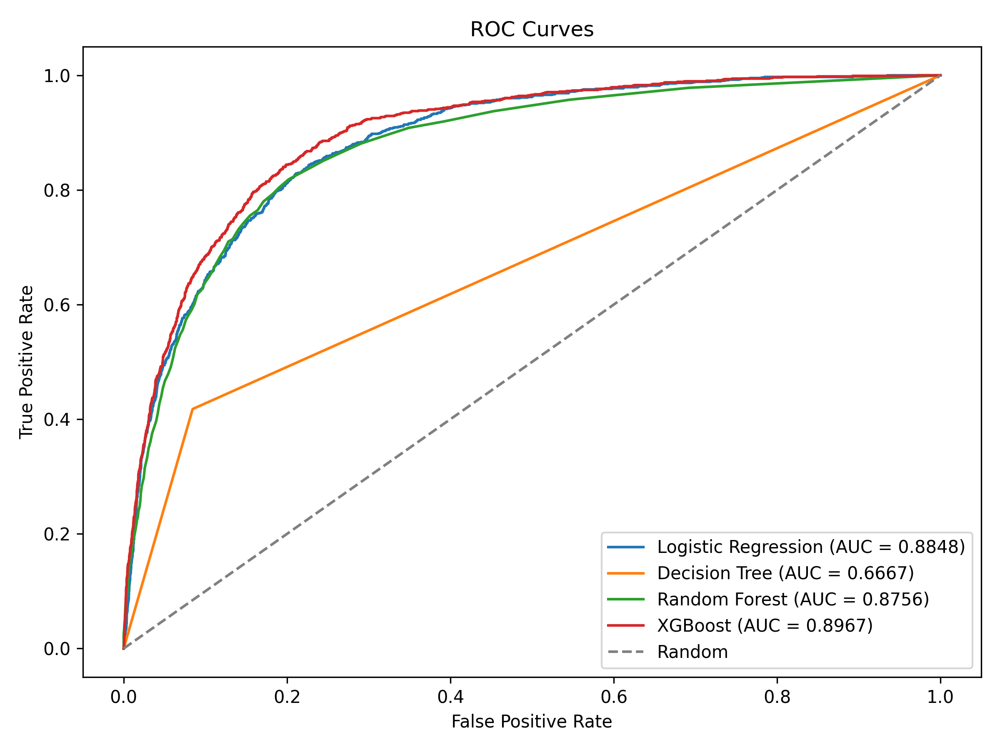
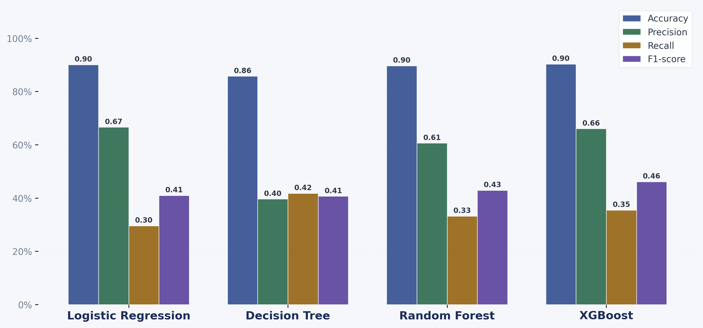
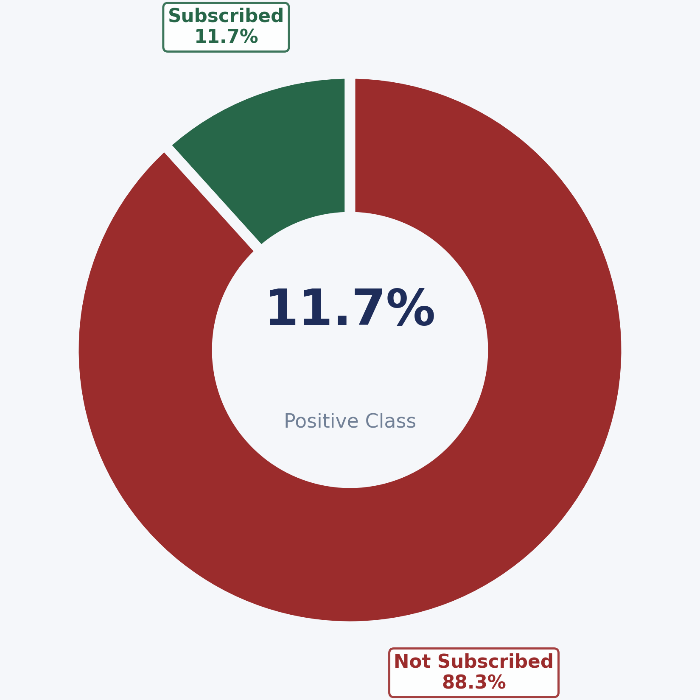
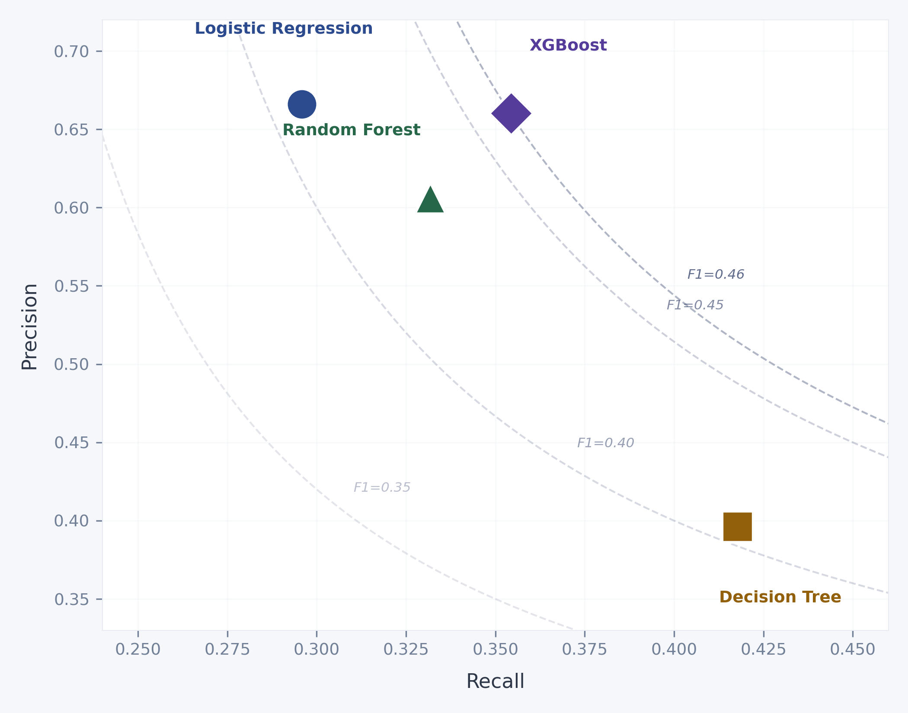
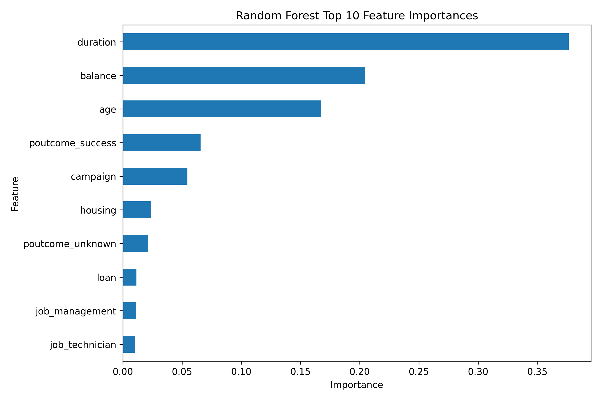

# Bank Term Deposit Prediction

A machine learning project that predicts whether a bank customer will subscribe to a term deposit, based on the UCI Bank Marketing dataset. Four classifiers are trained, evaluated, and compared using standard classification metrics.

## Overview

- **Task:** Binary classification (subscribed: yes / no)
- **Dataset:** Preprocessed bank marketing data (`data/X_bank.csv`, `data/y_bank.csv`)
- **Split:** 80% train / 20% test (stratified)
- **Models:** Logistic Regression, Decision Tree, Random Forest, XGBoost

## Results

| Model               | Accuracy | Precision | Recall | F1-Score |
|---------------------|----------|-----------|--------|----------|
| Logistic Regression | 0.9002   | 0.6660    | 0.2958 | 0.4097   |
| Decision Tree       | 0.8573   | 0.3961    | 0.4178 | 0.4066   |
| Random Forest       | 0.8966   | 0.6062    | 0.3318 | 0.4288   |
| XGBoost             | **0.9031**   | **0.6602**    | 0.3544 | **0.4613**   |

### ROC Curves



### Model Metric Comparison



### Class Distribution



### Precision vs Recall



### Random Forest — Top 10 Feature Importances



## Project Structure

```text
bank_term_deposit_project/
├── data/
│   ├── X_bank.csv              # feature matrix
│   ├── y_bank.csv              # target labels
│   └── bank_cleaned.csv        # cleaned raw data
├── notebooks/
│   └── CMPE255GroupProject.ipynb   # data preprocessing and EDA
├── src/
│   └── modeling.py             # model training, evaluation, and plots
├── outputs/                    # generated plots and results
├── slides_notes/
│   ├── Plans.docx
│   └── EDA.docx
├── .gitignore
└── README.md
```

## Setup

```bash
python3 -m venv .venv
```

macOS / Linux:
```bash
source .venv/bin/activate
```

Windows:
```bash
.venv\Scripts\Activate.ps1
```

Install dependencies:
```bash
pip install pandas matplotlib scipy scikit-learn xgboost
```

## Run

```bash
python src/modeling.py
```

Prints metrics to the terminal and saves all plots and the comparison CSV to `outputs/`.
